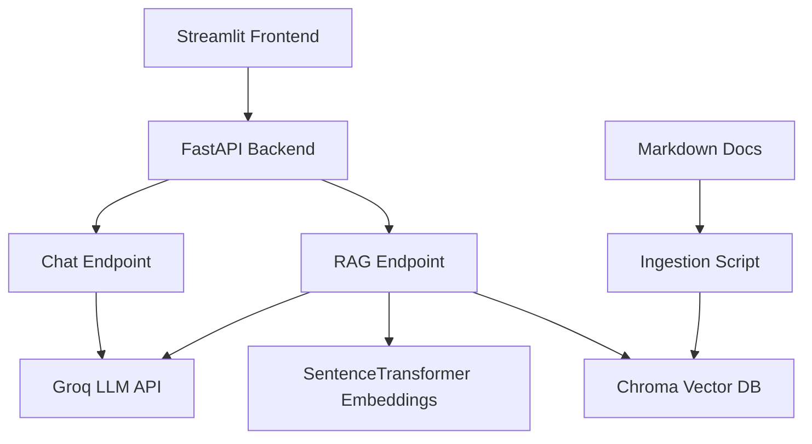

# KnowledgePilot AI

A production-style GenAI application built for the GenAI Developer Technical Challenge.

KnowledgePilot AI combines:

* **LLM Chat Assistant** powered by Groq
* **RAG (Retrieval-Augmented Generation)** over internal company knowledge documents
* **FastAPI backend**
* **Streamlit frontend**
* **Chroma vector database**
* **Dockerized local deployment**
* **Automated tests with Pytest**

---

# Demo Features

## Base Chat Mode

Talk directly with an LLM through the backend API.

## RAG Knowledge Assistant

Ask grounded questions over internal company policies such as:

* Vacation policy
* Pricing plans
* Security rules
* Benefits
* Expense reimbursements
* Equipment policy
* Support SLA

Responses include document sources used during retrieval.

---

# Architecture Overview



---

# Tech Stack

## Backend

* FastAPI
* Pydantic v2
* Uvicorn

## LLM

* Groq API
* Model: `llama-3.1-8b-instant`

## RAG Stack

* ChromaDB
* sentence-transformers
* all-MiniLM-L6-v2
* LangChain text splitters

## Frontend

* Streamlit

## DevOps

* Docker
* Docker Compose

## Testing

* Pytest
* httpx

---

# Project Structure

```text
knowledgepilot-ai/
│── app/
│   ├── api/v1/
│   ├── core/
│   ├── schemas/
│   ├── services/
│
│── docs/
│── scripts/
│── streamlit_app/
│── tests/
│── docker-compose.yml
│── Dockerfile.backend
│── Dockerfile.frontend
│── pyproject.toml
```

---

# Local Setup

## 1. Clone Repository

```bash
git clone <your-repo-url>
cd knowledgepilot-ai
```

## 2. Install Dependencies

```bash
uv sync
```

## 3. Configure Environment

Create `.env`

```env
GROQ_API_KEY=your_key_here
MODEL_NAME=llama-3.1-8b-instant
CHROMA_PATH=chroma_db
```

## 4. Run Document Ingestion

```bash
python scripts/ingest.py
```

## 5. Start Backend

```bash
python -m uvicorn app.main:app --reload
```

Backend docs:

```text
http://localhost:8000/docs
```

## 6. Start Frontend

```bash
python -m streamlit run streamlit_app/app.py
```

Frontend:

```text
http://localhost:8501
```

---

# Docker Setup

Run entire stack:

```bash
docker compose up --build
```

Services:

* Backend: http://localhost:8000/docs
* Frontend: http://localhost:8501

---

# API Examples

## Healthcheck

```bash
curl http://localhost:8000/api/v1/healthcheck
```

---

## Chat Endpoint

```bash
curl -X POST http://localhost:8000/api/v1/chat \
-H "Content-Type: application/json" \
-d "{\"message\":\"What is Python?\"}"
```

---

## RAG Endpoint

```bash
curl -X POST http://localhost:8000/api/v1/rag-query \
-H "Content-Type: application/json" \
-d "{\"query\":\"How many vacation days do employees receive?\",\"top_k\":3}"
```

---

# Prompt Engineering Notes

## Base Chat Prompt

The chat endpoint uses a system prompt instructing the model to:

* be concise
* be helpful
* avoid fabricating facts
* acknowledge uncertainty

## RAG Prompt

The RAG pipeline instructs the model to:

* answer **only** using retrieved context
* explicitly state when answer is unavailable
* remain grounded in company documents

This reduces hallucinations and improves factual consistency.

---

# Testing

Run tests:

```bash
pytest -v
```

Current coverage includes:

* health endpoint
* request schemas
* validation flow

---

# GenAI Coding Assistants Used

Used ChatGPT as a coding assistant for:

* architecture planning
* boilerplate generation
* Docker setup
* debugging environment issues
* improving README quality

All generated code was reviewed, adapted, tested, and corrected manually.

---

# Future Improvements

* JWT authentication
* Conversation memory
* LangFuse observability
* LangGraph workflows
* CI/CD deployment pipeline
* Hybrid search + reranking
* Evaluation metrics for RAG quality

---

# Why This Project

This project demonstrates practical GenAI engineering skills:

* API design
* LLM integration
* RAG implementation
* vector search
* prompt engineering
* containerization
* testing
* product-oriented delivery

---

This project was designed to demonstrate practical GenAI engineering skills with free tools, clean architecture, and production-minded delivery.